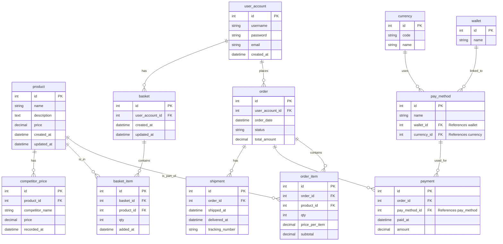

```mermaid
erDiagram
    user_account {
        int id PK
        string username
        string password
        string email
        datetime created_at
    }

    product {
        int id PK
        string name
        text description
        decimal price
        datetime created_at
        datetime updated_at
    }

    order {
        int id PK
        int user_account_id FK
        datetime order_date
        string status
        decimal total_amount
    }

    order_item {
        int id PK
        int order_id FK
        int product_id FK
        int qty
        decimal price_per_item
        decimal subtotal
    }

    basket {
        int id PK
        int user_account_id FK
        datetime created_at
        datetime updated_at
    }

    basket_item {
        int id PK
        int basket_id FK
        int product_id FK
        int qty
        datetime added_at
    }

    competitor_price {
        int id PK
        int product_id FK
        string competitor_name
        decimal price
        datetime recorded_at
    }

    payment {
        int id PK
        int order_id FK
        int pay_method_id FK "References pay_method"
        datetime paid_at
        decimal amount
    }

    pay_method {
        int id PK
        string name
        int wallet_id FK "References wallet"
        int currency_id FK "References currency"
    }

    wallet {
        int id PK
        string name
    }

    currency {
        int id PK
        string code
        string name
    }

    shipment {
        int id PK
        int order_id FK
        datetime shipped_at
        datetime delivered_at
        string tracking_number
    }

    user_account ||--o{ order : places
    user_account ||--o{ basket : has
    order ||--o{ order_item : contains
    order ||--o{ payment : has
    order ||--o{ shipment : has
    product ||--o{ order_item : is_part_of
    product ||--o{ basket_item : is_in
    product ||--o{ competitor_price : has
    basket ||--o{ basket_item : contains
    pay_method ||--o{ payment : used_for
    wallet ||--o{ pay_method : linked_to
    currency ||--o{ pay_method : uses
```