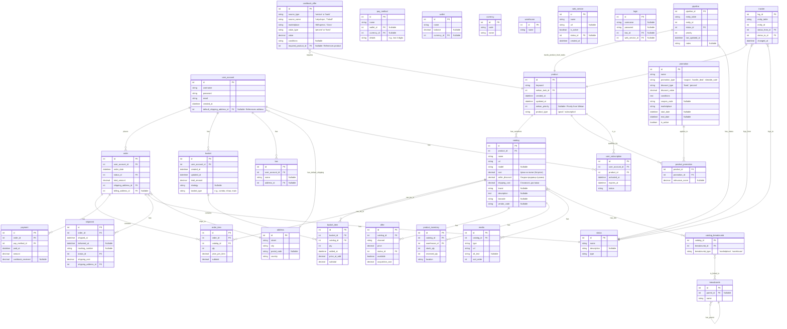

```mermaid
erDiagram
    user_account {
        int id PK
        string username
        string password
        string email
        datetime created_at
        int default_shipping_address_id FK "Nullable: References address"
    }

    product {
        int id PK
        string keyword
        int wekan_task_id FK
        datetime created_at
        datetime updated_at
        int wekan_priority "Nullable: Priority from Wekan"
        string product_type "'good', 'subscription'"
    }

    order {
        int id PK
        int user_account_id FK
        datetime order_date
        int status_id FK
        decimal total_amount
        int shipping_address_id FK
        int billing_address_id FK "Nullable"
    }

    order_item {
        int id PK
        int order_id FK
        int catalog_id FK
        int qty
        decimal price_per_item
        decimal subtotal
    }

    basket {
        int id PK
        int user_account_id FK
        datetime created_at
        datetime updated_at
        decimal total_amount
        string strategy "Nullable"
        string basket_type "e.g., combo, nihao, main"
    }

    basket_item {
        int id PK
        int basket_id FK
        int catalog_id FK
        int qty
        datetime added_at
        decimal price_at_add
        decimal subtotal
    }

    catalog {
        int id PK
        int product_id FK
        string name
        string url
        string model "Nullable"
        decimal cost "Цена на полке (list price)"
        decimal seller_discount "Скидка продавца (сумма)"
        decimal shipping_cost "Стоимость доставки"
        string brand "Nullable"
        text description "Nullable"
        string barcode "Nullable"
        string vendor_code "Nullable"
    }

    cashback_offer {
        int id PK
        string source_type "'service' or 'bank'"
        string source_name "'Letyshops', 'Tinkoff'"
        string marketplace "'AliExpress', 'Ozon'"
        string value_type "'percent' or 'fixed'"
        decimal value
        string conditions "Nullable"
        int required_product_id FK "Nullable: References product"
    }

    promotion {
        int id PK
        string name
        string promotion_type "'coupon', 'bundle_deal', 'sitewide_sale'"
        string discount_type "'fixed', 'percent'"
        decimal discount_value
        text conditions
        string coupon_code "Nullable"
        string marketplace
        datetime start_date "Nullable"
        datetime end_date "Nullable"
        boolean is_active
    }

    product_promotion {
        int product_id FK
        int promotion_id FK
        decimal relevance_score "Nullable"
    }

    catalog_breadcrumb {
        int catalog_id FK
        int breadcrumb_id FK
        string breadcrumb_type "'marketplace', 'warehouse'"
    }

    breadcrumb {
        int id PK
        int parent_id FK "Nullable"
        string name
    }

    payment {
        int id PK
        int order_id FK
        int pay_method_id FK
        datetime paid_at
        decimal amount
        decimal cashback_received "Nullable"
    }

    pay_method {
        int id PK
        string name
        int wallet_id FK "Nullable"
        int currency_id FK "Nullable"
        string details "e.g., last 4 digits"
    }

    wallet {
        int id PK
        string name
        decimal balance "Nullable"
        int currency_id FK "Nullable"
    }

    currency {
        int id PK
        string code
        string name
    }

    shipment {
        int id PK
        int order_id FK
        datetime shipped_at
        datetime delivered_at "Nullable"
        string tracking_number "Nullable"
        int status_id FK
        decimal shipping_cost
        int shipping_address_id FK
    }

    offer {
        int id PK
        int catalog_id FK
        string channel
        decimal price
        int status_id FK
        boolean available
        decimal acquisition_cost
    }

    media {
        int id PK
        int catalog_id FK
        string type
        string url
        string alt_text "Nullable"
        int sort_order
    }

    product_inventory {
        int id PK
        int catalog_id FK
        int warehouse_id FK
        int stock_qty
        int reserved_qty
        string location
    }

    warehouse {
        int id PK
        string name
    }

    web_service {
        int id PK
        string name
        string url "Nullable"
        boolean is_active
        int status_id FK "Nullable"
        datetime created_at
    }

    box {
        int id PK
        int user_account_id FK
        string name "Nullable"
        int address_id FK "Nullable"
    }

    status {
        int id PK
        string name
        string description "Nullable"
        string type
    }

    login {
        int id PK
        string username "Nullable"
        string password "Nullable"
        int box_id FK "Nullable"
        int web_service_id FK "Nullable"
    }

    address {
        int id PK
        string street
        string city
        string postal_code "Nullable"
        string country
    }

    pipeline {
        int pipeline_id PK
        string entity_table
        int entity_id
        int status_id FK
        int priority
        datetime last_updated_at
        string notes "Nullable"
    }

    tracker {
        int log_id PK
        string entity_table
        int entity_id
        int status_from_id FK
        int status_to_id FK
        datetime changed_at
    }

    user_subscription {
        int id PK
        int user_account_id FK
        int product_id FK
        datetime activated_at
        datetime expires_at
        string status
    }
    
    user_account ||--o{ order : places
    user_account ||--o{ basket : has
    user_account ||--o{ box : has
    user_account }o--|| address : has_default_shipping
    user_account ||--o{ user_subscription : has
    
    product ||--o{ catalog : has_variations
    product ||--o{ product_promotion : qualifies_for
    product ||--o{ user_subscription : is_a
    
    cashback_offer }o--|| product : requires

    promotion ||--o{ product_promotion : applies_to
    
    catalog ||--o{ basket_item : can_be_in
    catalog ||--o{ order_item : can_be_in
    catalog ||--o{ offer : has
    catalog ||--o{ product_inventory : has
    catalog ||--o{ media : has
    
    catalog }o--o{ catalog_breadcrumb : has_link
    catalog_breadcrumb }o--o{ breadcrumb : is_linked_to

    breadcrumb }o--|| breadcrumb : has_parent
    
    basket ||--o{ basket_item : contains
    
    order ||--o{ order_item : contains
    order ||--o{ payment : has
    order ||--o{ shipment : has
    order }|--|| status : has
    order }|--|| address : ships_to
    
    pipeline ||--|| product : tracks_product_level_tasks
    pipeline }|--|| status : has_status
    
    tracker ||--|| product : logs_for_product
    tracker }|--|| status : logs_from
    tracker }|--|| status : logs_to

```