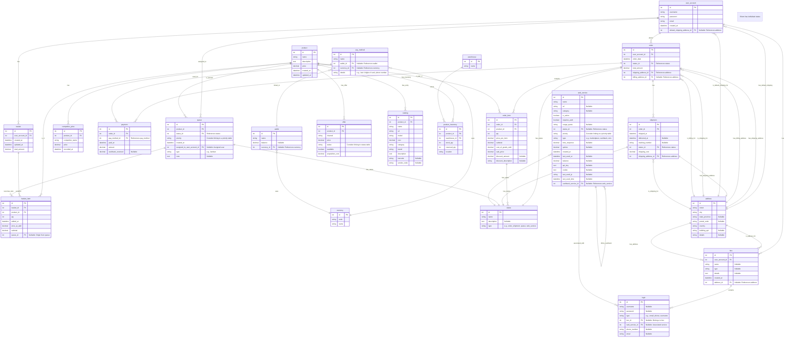

```mermaid
erDiagram
    user_account {
        int id PK
        string username
        string password
        string email
        datetime created_at
        int default_shipping_address_id FK "Nullable: References address"
    }

    product {
        int id PK
        string name
        text description
        decimal price
        datetime created_at
        datetime updated_at
    }

    order {
        int id PK
        int user_account_id FK
        datetime order_date
        int status_id FK "References status"
        decimal total_amount
        int shipping_address_id FK "References address"
        int billing_address_id FK "Nullable: References address"
    }

    order_item {
        int id PK
        int order_id FK
        int product_id FK
        int qty
        decimal price_per_item
        decimal subtotal
        decimal cost_of_goods_sold
        decimal sale_price
        decimal discount_amount "Nullable"
        string discount_description "Nullable"
    }

    basket {
        int id PK
        int user_account_id FK
        datetime created_at
        datetime updated_at
        decimal total_amount
    }

    basket_item {
        int id PK
        int basket_id FK
        int product_id FK
        int qty
        datetime added_at
        decimal price_at_add
        decimal subtotal
        int queue_id FK "Nullable: Origin from queue"
    }

    competitor_price {
        int id PK
        int product_id FK
        string competitor_name
        decimal price
        datetime recorded_at
    }

    payment {
        int id PK
        int order_id FK
        int pay_method_id FK "References pay_method"
        datetime paid_at
        decimal amount
        decimal cashback_received "Nullable"
    }

    pay_method {
        int id PK
        string name
        int wallet_id FK "Nullable: References wallet"
        int currency_id FK "Nullable: References currency"
        string details "e.g., last 4 digits of card, phone number"
    }

    wallet {
        int id PK
        string name
        decimal balance "Nullable"
        int currency_id FK "Nullable: References currency"
    }

    currency {
        int id PK
        string code
        string name
    }

    shipment {
        int id PK
        int order_id FK
        datetime shipped_at
        datetime delivered_at "Nullable"
        string tracking_number "Nullable"
        int status_id FK "References status"
        decimal shipping_cost
        int shipping_address_id FK "References address"
    }

    offer {
        int id PK
        int product_id FK
        string channel
        decimal price
        string status "Consider linking to status table"
        boolean available
        decimal acquisition_cost
    }

    catalog {
        int id PK
        int product_id FK
        string name
        string url
        string model
        decimal cost
        string category
        string brand
        text description
        string barcode "Nullable"
        string vendor_code "Nullable"
    }

    product_inventory {
        int id PK
        int product_id FK
        int warehouse_id FK
        int stock_qty
        int reserved_qty
        string location
    }

    warehouse {
        int id PK
        string name
    }

    queue {
        int id PK
        int product_id FK
        int status_id FK "References status"
        string priority "Consider linking to a priority table"
        datetime created_at
        int assigned_to_user_account_id FK "Nullable: Assigned user"
        string type "e.g., kanban"
        text note "Nullable"
    }

    web_service {
        int id PK
        string name
        string url "Nullable"
        string category "Nullable"
        boolean is_active
        boolean requires_auth
        string usage_quota "Nullable"
        int status_id FK "Nullable: References status"
        string priority "Consider linking to a priority table"
        string type "e.g., marketplace, cashback, sms"
        decimal time_response "Nullable"
        decimal uptime "Nullable"
        datetime created_at
        datetime last_used_at "Nullable"
        decimal balance "Nullable"
        text api_key "Nullable"
        text cookie "Nullable"
        string last_used_ip "Nullable"
        datetime last_used_time "Nullable"
        int cashback_service_id FK "Nullable: References web_service"
    }

    box {
        int id PK
        int user_account_id FK
        string name "Nullable"
        string type "Nullable"
        text details "Nullable"
        datetime created_at
        int address_id FK "Nullable: References address"
    }

    status {
        int id PK
        string name
        text description "Nullable"
        string type "e.g., order_shipment, queue, web_service"
    }

    login {
        int id PK
        string username "Nullable"
        string password "Nullable"
        string type "e.g., email, phone, username"
        int box_id FK "Nullable: Belongs to box"
        int web_service_id FK "Nullable: Associated service"
        string phone_number "Nullable"
        string email "Nullable"
    }

    address {
        int id PK
        string street
        string city
        string state_province "Nullable"
        string postal_code "Nullable"
        string country
        string building_apt "Nullable"
        string details "Nullable"
    }

    user_account ||--o{ order : places
    user_account ||--o{ basket : has
    user_account ||--o{ queue : assigned_to
    user_account ||--o{ box : has
    user_account }o--|| address : has_default_shipping
    order ||--o{ order_item : contains
    order ||--o{ payment : has
    order ||--o{ shipment : has
    order ||--|| status : has_status
    order ||--|| address : has_shipping_address
    order }o--|| address : has_billing_address
    order_item ||--o{ status : has_status "If item has individual status"
    product ||--o{ order_item : is_part_of
    product ||--o{ basket_item : is_in
    product ||--o{ competitor_price : has
    product ||--o{ offer : has_offer
    product ||--o{ catalog : has_entry
    product ||--o{ product_inventory : has_inventory
    product ||--o{ queue : is_queued
    basket ||--o{ basket_item : contains
    pay_method ||--o{ payment : used_for
    pay_method }o--|| wallet : linked_to
    pay_method }o--|| currency : uses
    wallet }o--|| currency : uses
    shipment ||--|| status : has_status
    shipment ||--|| address : has_shipping_address
    warehouse ||--o{ product_inventory : stores
    queue ||--|| status : has_status
    queue ||--o{ basket_item : becomes_item
    box }o--|| address : has_address
    box ||--o{ login : contains
    web_service ||--o{ login : associated_with
    web_service }o--|| web_service : offers_cashback
    web_service }o--|| status : has_status
    address ||--o{ user_account : is_default_shipping_for
    address ||--o{ order : is_shipping_for
    address ||--o{ order : is_billing_for
    address ||--o{ shipment : is_shipping_for
    address ||--o{ box : is_address_for
```