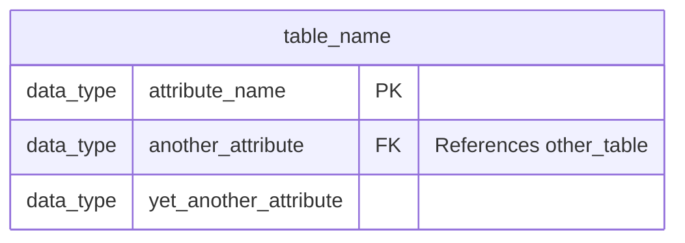
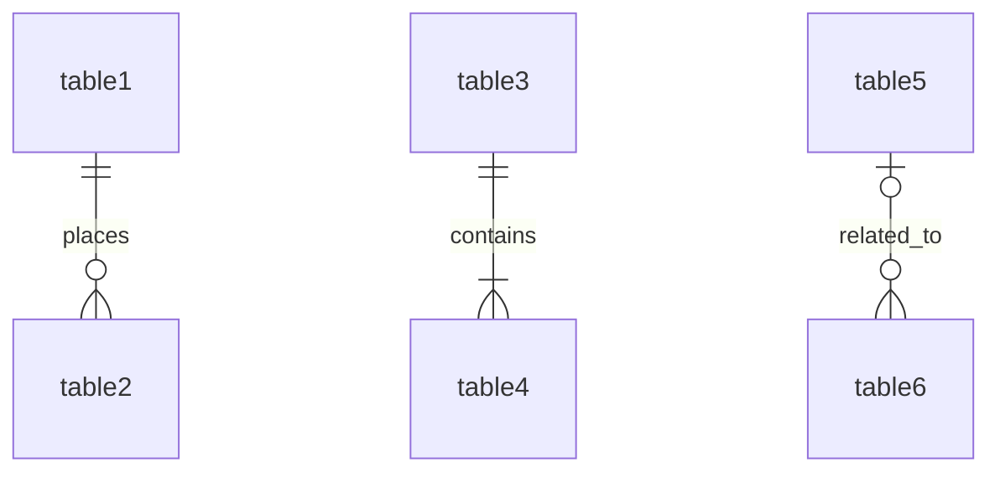

### ✅ **Mermaid-схемы БД — компактные правила**

Используем формат `erDiagram` для построения схем.

#### 1. **Именование таблиц**

*   `snake_case` — везде один стиль.
*   Таблицы в **единственном числе**: `user_account`, `product`, `order`.

#### 2. **Структура таблицы**

*   Формат: `тип_данных имя_атрибута`
*   `PK` обозначает первичный ключ.
*   `FK` обозначает внешний ключ.
*   Пояснения для внешних ключей указываются в кавычках: `"References ..."` или `"Description"`.

#### 3. **Типы данных (для SQLite)**

Используем следующие типы данных в схеме, сопоставляя их с типами SQLite:

| Схема (Mermaid ER) | SQLite     | Описание                                     |
| ------------------ | ---------- | -------------------------------------------- |
| `int`              | `INTEGER`  | Целые числа (для ID, количества)             |
| `string`           | `TEXT`     | Текстовые строки короткой/средней длины      |
| `text`             | `TEXT`     | Более длинные текстовые поля                 |
| `decimal`          | `REAL`     | Числа с плавающей точкой (для цен, сумм)     |
| `datetime`         | `TEXT`     | Дата и время (хранить в формате ISO 8601)    |
| `boolean`          | `INTEGER`  | Логический тип (хранить как `0` или `1`)     |

#### 4. **Связи**

Используем следующий формат для связей, указывая кардинальность и название связи:

*   `||--o{`: Один к нулю или более.
*   `||--|{`: Один к одному или более.
*   `|o--o{`: Ноль или один к нулю или более.
*   `|o--|{`: Ноль или один к одному или более.
*   `|--o{`: Один или более к нулю или более.
*   `|--|{`: Один или более к одному или более.
*   `: relationship_name`: Название связи (опционально, но рекомендуется для ясности).
