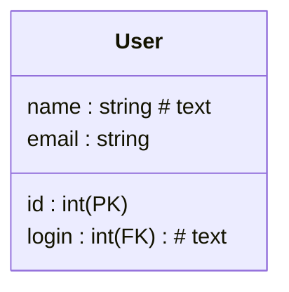
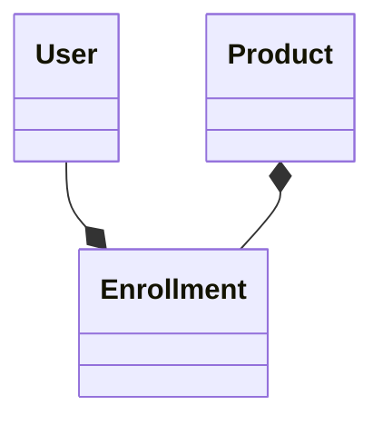

### ✅ **Mermaid-схемы БД — компактные правила**

#### 1. **Именование таблиц**

* `snake_case` — везде один стиль.
* Таблицы в **единственном числе**: `User`, `Order`, `Login`.
* Служебные таблицы: `UserRole`, `Enrollment` — допустимы.

#### 2. **Структура таблицы**

* Формат: `имя : тип # комментарий`
* Для classDiagram можно использовать скобки (иначе Mermaid ломается)
* Скобки для (PK), (FK) (CK) и # для пояснений

#### 3. **Типы данных**

| Mermaid-тип | SQLite-тип | Комментарий                                     |
| ----------- | ---------- | ----------------------------------------------- |
| `int`       | `INTEGER`  | Подходит для `id`, `чисел`, PK                  |
| `string`    | `TEXT`     | Подходит для любых строк                        |
| `bool`      | `INTEGER`  | SQLite не имеет `BOOLEAN`, храни как `0/1`      |
| `float`     | `REAL`     | Для дробных чисел                               |
| `date`      | `TEXT`     | Лучше ISO-формат (`YYYY-MM-DD`)                 |
| `json`      | `TEXT`     | SQLite не имеет `JSON`, храни строкой           |
| `blob`      | `BLOB`     | Для бинарных данных (файлы, изображения и т.п.) |

#### 4. **Связи**

* **1:1** — ` -- `
* **1:М** — ` --*`
* **М:1** — аналогично, направление важно
* **М:М** — через связующую таблицу